# 用例文档 第三阶段

## 更新历史

|           修改人员           |    日期    | 变更原因         | 版本号 |
| :--------------------------: | :--------: | :--------------- | :----: |
| 庄子元、程荣鑫、韩禧、郭礼华 | 2020.05.01 | 更新第三阶段用例 |  V3.0  |

## 目录

[TOC]

## 1. 引言

### 1.1 目的

本文档描述了酒店房间预订系统在**第三阶段**的需求，包括住户、酒店管理人员、系统维护人员。旨在通过本文档更好的明确各个阶段的需求，推动开发工作的进行。

### 1.2 阅读说明

文档内用例的描述使用了《软件工程与计算（卷二） 软件开发的技术基础》附表一的模板，按照课程要求撰写完成。

本文档内的说明如下：

1. 系统: 指的是软件工程与计算Ⅱ课程中大作业要求设计的酒店房间预订系统
2. 用户: 指本网站的线上访问者，分为已登录（下或称”已被识别或授权“）的客户和未登录的访客两种，用例说明在涉及到用户且对这两种用户未作区分的情况下，即认为两种用户均适用该用例情况，在文档中用A表示。
3. 酒店工作人员：指酒店方面的管理员，在文档中用B表示。
4. 管理员：指由系统所有方指派或雇佣的对系统后台有部分或全部操作权限的人员，激活管理员权限需要登录对应的管理员账户（下或称“已被识别或授权”），在文档中用C表示。
5. 《软件工程与计算（卷二） 软件开发的技术基础》中已经定义的名称（如用例、顺序图、状态图）在本文档中完全沿用其定义
6. 密码合法，指密码长度在6-16位，包含大写英文、小写英文、数字、英文字符中的至少两种
7. 未被上述词条定义的词汇均符合《现代汉语词典（第六版）》的定义

### 1.3 参考文献

《软件工程与计算（卷二） 软件开发的技术基础》

## 2. 用例图

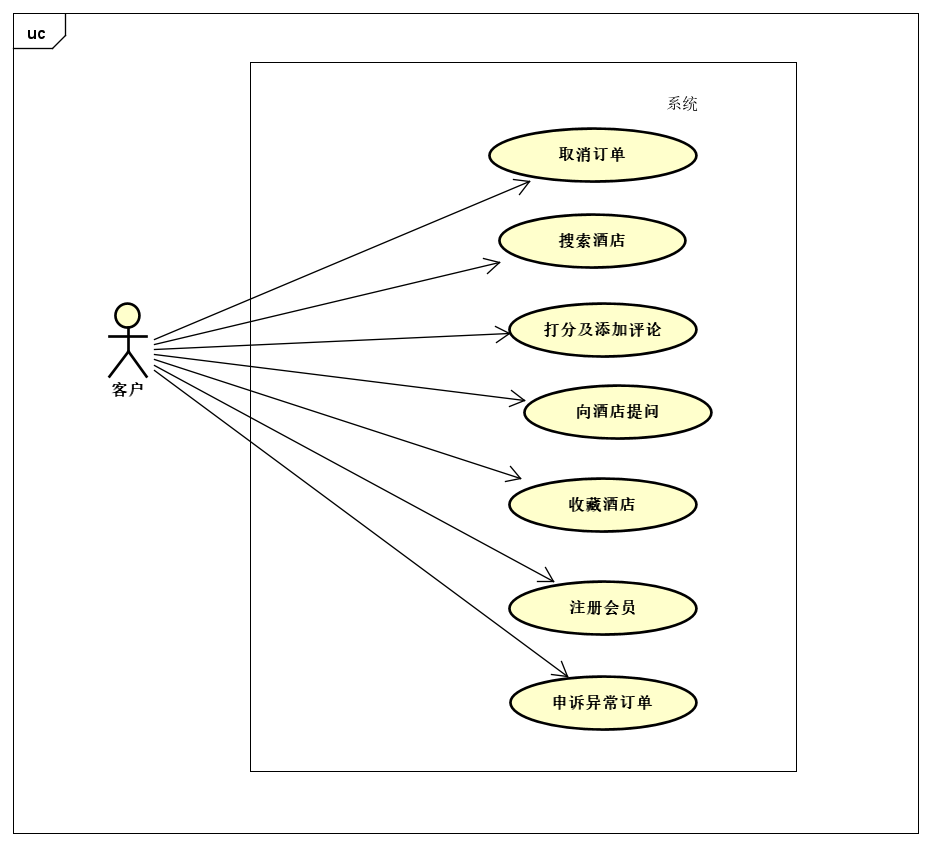

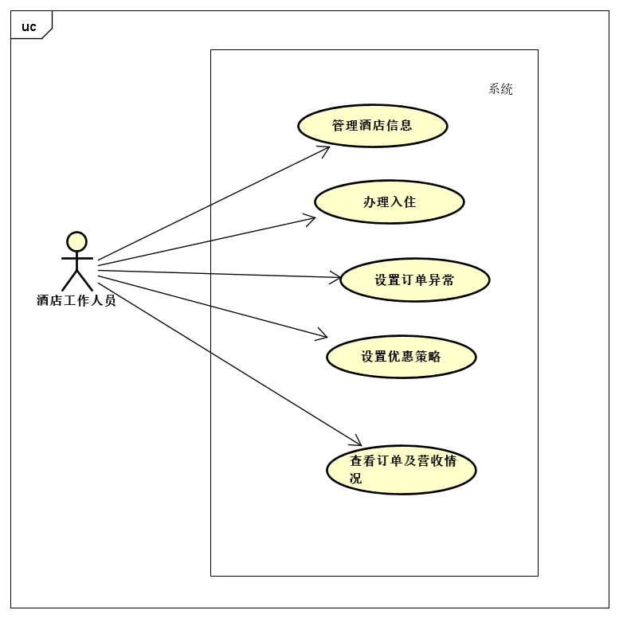

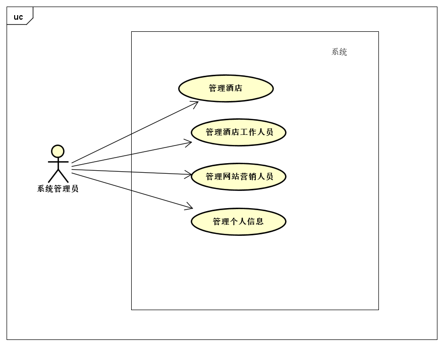

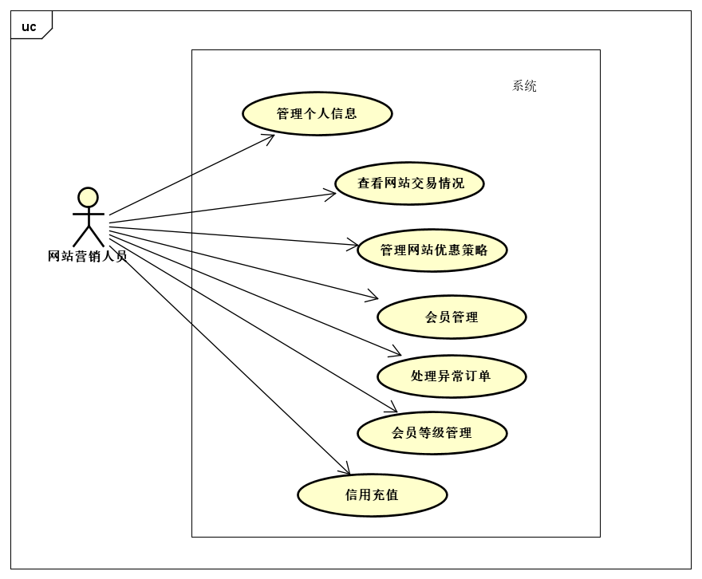

## 3. 用例列表

|  参与者  | 用例         |
| :------: | :----------- |
| 普通用户 | 搜索酒店     |
| 普通用户 | 取消订单     |
| 普通用户 | 添加评论     |
| 普通用户 | 服务评分     |
| 普通用户 | 收藏酒店     |
| 普通用户 | 注册会员     |
| 普通用户 | 申诉异常订单 |

| 参与者       | 用例               |
| ------------ | ------------------ |
| 酒店工作人员 | 管理酒店房间       |
| 酒店工作人员 | 办理入住           |
| 酒店工作人员 | 设置订单异常       |
| 酒店工作人员 | 设置优惠策略       |
| 酒店工作人员 | 查看订单及营收情况 |

| 参与者     | 用例             |
| ---------- | ---------------- |
| 系统管理员 | 管理酒店         |
| 系统管理员 | 管理酒店工作人员 |
| 系统管理员 | 管理网站营销人员 |
| 系统管理员 | 管理个人信息     |

| 参与者       | 用例             |
| ------------ | ---------------- |
| 网站营销人员 | 管理个人信息     |
| 网站营销人员 | 查看网站交易情况 |
| 网站营销人员 | 管理网站优惠策略 |
| 网站营销人员 | 会员管理         |
| 网站营销人员 | 处理异常订单     |
| 网站营销人员 | 会员等级管理     |
| 网站营销人员 | 信用充值         |

## 4. 详细用例描述

*注：4.1~4.9为第一阶段和第二阶段的需求，第三阶段从4.10开始*

### 4.10 搜索酒店

* 用例编号：AUR.5
* 名称：搜索酒店
* 创建者：韩禧
* 创建日期：2020/05/01
* 最后一次更新者：韩禧
* 更新日期：2020/05/01
* 参与者 ：用户，目标是搜索需要的酒店
* 触发条件：
  1. 用户打开搜索页面
* 前置条件：
  1. 用户已登陆
* 后置条件：
  1. 系统对搜索内容进行处理并返回需要的结果
* 优先级：中
* 正常流程：
  1. 用户点击”开始搜索“进入搜索页面
  2. 用户填写搜索表单
  3. 用户提交搜索表单
  4. 系统返回搜索结果
* 扩展流程：
  * 1a.表单没有符合要求的选项
    - 2.填写用户反馈给系统管理员
  * 2a.提交搜索表单后反馈填写错误
    - 3.根据反馈信息修改表单
    - 4.重新提交表单
  * 3a.搜索结果没有满意的内容，或无符合表单要求的酒店
    - 4.改变搜索条件，重新填写表单，或停止搜索
* 特殊需求：
  * 对表单中的多个信息进行计算、评分，将符合需要的酒店按得分高低依次排列

### 4.11 取消订单

* 用例编号：AUR.6
* 名称：取消订单
* 创建者：韩禧
* 创建日期：2020/05/01
* 最后一次更新者：韩禧
* 更新日期：2020/05/01
* 参与者 ：用户，目标是将不再需要的酒店取消
* 触发条件：
  1. 用户有已提交的订单需要取消
* 前置条件：
  1. 用户已登陆
  2. 用户有未完成的订单
* 后置条件：
  1. 系统对取消订单进行记录及相关操作
* 优先级：中
* 正常流程：
  1. 用户进入”个人中心“里”我的订单“页面
  2. 用户找到需要取消的订单
  3. 用户点击“取消订单”按钮
  4. 用户点击“确定”按钮
  5. 系统将订单取消
  6. 系统返回取消结果
* 扩展流程：
  * 3a.用户放弃取消订单
    - 4.用户点击“取消”，停止修改
* 特殊需求：
  * 不可取消的订单不会出现“取消订单”按钮，防止用户错误操作
  * 在入住时间前12h内取消订单，需要扣除信用分

### 4.12 打分及添加评论

* 用例编号：AUR.7
* 名称：打分添加评论
* 创建者：韩禧
* 创建日期：2020/05/01
* 最后一次更新者：韩禧
* 更新日期：2020/05/01
* 参与者 ：用户，目标是在入住酒店后进行评论并展示，为其他用户提供参考，也为酒店提升服务质量提出建议
* 触发条件：
  1. 用户有订单处于入住完成的待评价状态
  2. 用户希望进行评价
* 前置条件：
  1. 用户已登陆
  2. 用户有已完成的订单
* 后置条件：
  1. 系统对评论行为进行处理
* 优先级：中
* 正常流程：
  1. 用户进入订单页面
  2. 用户点击“评价”按钮
  3. 用户在评价窗口中，完成各项打分并输入自己的评价内容
  4. 用户点击提交
  5. 系统处理评价
* 扩展流程：
  * 3a.用户未完成打分
    - 4.用户先进行打分，在添加评价内容
  * 3b.用户已评价过
    * 4a.用户点击“撤销”按钮，重新进行评价
    * 4b.用户放弃评价，关闭页面
  * 4a.用户放弃评价
    * 5.点击“取消”或右上角关闭按钮，退出评价
  * 4b.用户评论过长
    * 5.用户将评论删减至限定长度
* 特殊需求：
  * 可以撤销评价及多次评价

### 4.13 向酒店提问

* 用例编号：AUR.8
* 名称：向酒店提问
* 创建者：韩禧
* 创建日期：2020/05/01
* 最后一次更新者：韩禧
* 更新日期：2020/05/01
* 参与者 ：用户，目标是为酒店服务进行打分，以供参考
* 触发条件：
  1. 用户有对酒店的问题，希望通过提问获得解答
* 前置条件：
  1. 用户已登陆
* 后置条件：
  1. 系统对提问及回答进行记录和展示
* 优先级：中
* 正常流程：
  1. 用户进入酒店页面，点击进入”了解详情“
  2. 用户点击”常见问题“，查看已有问题及进行提问
  3. 用户输入问题
  4. 用户点击”我要提问“按钮
  5. 系统处理提问并展示
* 扩展流程：
  * 3a.用户在已有问题中找到了相同问题及解答
    * 4.用户完成愿望，不再提问

- 特殊需求：
  - 提问可以被多次回答
  - 提问不可撤销

### 4.14 收藏酒店

* 用例编号：AUR.9
* 名称：收藏酒店
* 创建者：韩禧
* 创建日期：2020/05/01
* 最后一次更新者：韩禧
* 更新日期：2020/05/01
* 参与者 ：用户，目标是将有兴趣的酒店进行收藏，方便查找
* 触发条件：
  1. 用户对酒店产生兴趣与需求
* 前置条件：
  1. 用户已登陆
* 后置条件：
  1. 系统对收藏操作进行记录
* 优先级：高
* 正常流程：
  1. 用户进入酒店页面
  2. 用户点击“了解详情”进入酒店详情页面
  3. 用户在详情中的“酒店点评”部分，右上方找到“收藏该酒店”
  4. 用户点击进行收藏
  5. 系统处理用户的收藏请求
* 扩展流程：
  * 5a.用户已收藏酒店，想取消收藏
    * 6.用户点击“取消收藏”按钮，进行取消

- 特殊需求：
  - 用户可以在“个人中心”里“我的收藏”部分查看收藏的酒店

### 4.15 注册会员

* 用例编号：AUR.10
* 名称：注册会员
* 创建者：韩禧
* 创建日期：2020/05/01
* 最后一次更新者：韩禧
* 更新日期：2020/05/01
* 参与者 ：用户，目标是通过注册为会员，及享受会员特权等
* 触发条件：
  1. 用户产生注册为会员的需求
* 前置条件：
  1. 用户已登陆且尚未注册会员
* 后置条件：
  1. 系统对用户注册行为进行记录，并将会员权益授予用户
* 优先级：中
* 正常流程：
  1. 用户进入会员中心
  2. 用户选择相应的会员，点击注册（分为 企业会员 和 网站会员）
  3. 系统进行注册处理
* 扩展流程：
  * 2a.选择注册为企业会员
    * 3.在窗口中输入企业名称
    * 4.点击注册
  * 2b.选择注册为网站会员
    * 3.在窗口中选择生日
    * 4.点击注册

- 特殊需求：
  - 会员积累一定消费后可以提升等级

### 4.16 申诉异常订单

* 用例编号：AUR.10
* 名称：申诉异常订单
* 创建者：韩禧
* 创建日期：2020/05/01
* 最后一次更新者：韩禧
* 更新日期：2020/05/01
* 参与者 ：用户，目标是对被判定为异常的订单进行申诉
* 触发条件：
  1. 用户出现被标记为异常的订单
  2. 用户希望通过申诉解决问题
* 前置条件：
  1. 用户已登陆
* 后置条件：
  1. 系统对用户的申诉进行反馈，并由管理人员核实
* 优先级：中
* 正常流程：
  1. 用户进入会员中心
  2. 用户选择相应的会员，点击注册（分为 企业会员 和 网站会员）
  3. 系统进行注册处理
* 扩展流程：
  * 2a.选择注册为企业会员
    * 3.在窗口中输入企业名称
    * 4.点击注册
  * 2b.选择注册为网站会员
    * 3.在窗口中选择生日
    * 4.点击注册

- 特殊需求：
  - 会员积累一定消费后可以提升等级
  - 会员等级管理由网站营销人员管理

### 4.17 管理酒店房间

* 用例编号：BUR.4
* 名称：管理酒店房间
* 创建者：韩禧
* 创建日期：2020/05/01
* 最后一次更新者：韩禧
* 更新日期：2020/05/01
* 参与者 ：酒店工作人员
* 触发条件：
  1. 酒店工作人员需要管理更新客房信息
* 前置条件：
  1. 酒店已录入客房信息
  2. 酒店工作人员已登陆
* 后置条件：
  1. 系统对更新后的客房信息进行存储与展示
* 优先级：高
* 正常流程：
  1. 酒店工作人员进入“酒店经营”页面中的“客房管理”部分
  2. 点击”录入客房“按钮
  3. 填写客房表单
  4. 点击提交
  5. 系统录入客房
* 扩展流程：
  * 2a.仍需保留客房，只是更改基本信息
    * 3.点击“录入客房”按钮
    * 4.在录入表单中选择需要更新的客房的房间类型，输入新的客房信息
    * 5.点击确定
    * 6.系统进行更新处理
  * 2b.对于不需要的客房，点击“删除”按钮
    * 3.系统进行删除处理

- 特殊需求：
  - 同一酒店中，不能同时存在多个同种类型的房间

### 4.18 办理入住

* 用例编号：BUR.5
* 名称：办理入住
* 创建者：韩禧
* 创建日期：2020/05/01
* 最后一次更新者：韩禧
* 更新日期：2020/05/01
* 参与者 ：酒店工作人员
* 触发条件：
  1. 酒店工作人员接待已经预订的顾客
* 前置条件：
  1. 顾客已经下单
  2. 订单处于“未入住”状态
* 后置条件：
  1. 系统将订单状态改变
* 优先级：高
* 正常流程：
  1. 酒店工作人员进入“酒店经营”页面中的“订单管理”部分
  2. 找到对应订单，点击“入住”按钮
  3. 系统进行入住处理，反馈提示信息
* 扩展流程：
  * 3a.订单未到入住时间
    * 4.无法入住，建议顾客取消订单后重新下单
  * 3b.订单已逾期
    * 4.将订单设置为异常后，点击处理异常
    * 5.订单转变为完成状态，顾客可以重新下单

- 特殊需求：
  - 异常订单、已经撤销的订单无法办理入住
  - 已经入住的订单无法取消入住状态

### 4.19 设置订单异常

* 用例编号：BUR.6
* 名称：办理入住
* 创建者：韩禧
* 创建日期：2020/05/01
* 最后一次更新者：韩禧
* 更新日期：2020/05/01
* 参与者 ：酒店工作人员
* 触发条件：
  1. 酒店工作人员清理异常订单
* 前置条件：
  1. 顾客已经下单
  2. 订单逾期未入住
* 后置条件：
  1. 系统将订单状态改变
* 优先级：中
* 正常流程：
  1. 酒店工作人员进入“酒店经营”页面中的“订单管理”部分
  2. 找到逾期未入住且未撤销的订单，点击”标记异常“
  3. 系统处理异常订单，并完成积分扣除等操作
* 扩展流程：
  * 2a.没有逾期未入住且未撤销的订单
    * 3.未发现异常订单，不进行任何处理
  * 3a.该订单不属于异常订单
    * 4.系统提示不可标记异常，不进行处理
  * 4a.为用户处理异常，点击”处理异常“按钮
    * 5.在验证中点击确定
    * 6.系统为用户补登入住，异常处理成功，订单状态改变，用户积分改变

- 特殊需求：
  - 将订单标记为异常后，对应客户会扣除信用分
  - 标记为异常的订单可以通过补登入住进行恢复

### 4.20 设置优惠策略

* 用例编号：BUR.7
* 名称：设置优惠策略
* 创建者：韩禧
* 创建日期：2020/05/01
* 最后一次更新者：韩禧
* 更新日期：2020/05/01
* 参与者 ：酒店工作人员
* 触发条件：
  1. 酒店推出或取消优惠活动
* 前置条件：
  1. 酒店工作人员已正常登陆
* 后置条件：
  1. 系统记录优惠策略变动，在顾客下单结算时进行处理
* 优先级：中
* 正常流程：
  1. 酒店工作人员进入“酒店经营”页面中的“优惠管理”部分
  2. 酒店工作人员点击”添加优惠策略“按钮
  3. 酒店工作人员在表单中填写优惠策略的内容
  4. 酒店工作人员点击”确定“按钮，完成添加
  5. 系统根据优惠策略表单进行处理，添加策略并反馈
* 扩展流程：
  * 2a.酒店工作人员点击优惠策略后的”删除优惠劵“按钮
    * 3.系统将优惠策略取消

- 特殊需求：
  - 无

### 4.21 查看订单及营收情况

* 用例编号：BUR.8
* 名称：查看订单及营收情况
* 创建者：韩禧
* 创建日期：2020/05/01
* 最后一次更新者：韩禧
* 更新日期：2020/05/01
* 参与者 ：酒店工作人员
* 触发条件：
  1. 酒店工作人员查看酒店订单及营收
* 前置条件：
  1. 酒店工作人员已正常登陆
* 后置条件：
  1. 后台数据与前端可视化功能正常运行
* 优先级：中
* 正常流程：
  1. 酒店工作人员进入”首页“
  2. 酒店工作人员根据可视化图表查看订单及营收情况
  3. 酒店工作人员点击右上角”数据视图“图标查看详细数据
  4. 酒店工作人员在”数据视图“中点击”刷新“来更新图表内容
* 扩展流程：
  * 3a.酒店工作人员点击”保存为图片“按钮
    * 4.选择保存路径后点击确定，营收的可视化图表被保存在本地

- 特殊需求：
  - 横轴表示日期（30天前到当天），两个纵轴表示订单和营收情况
  - 点击上方的”订单“或”收入“，可以选择让对应数值显示/不显示状态的切换

## 5. 需求分析模型

*注：4.1~4.9为第一阶段和第二阶段的需求，第三阶段从4.10开始*

### 5.1 系统顺序图

#### 4.10 搜索酒店

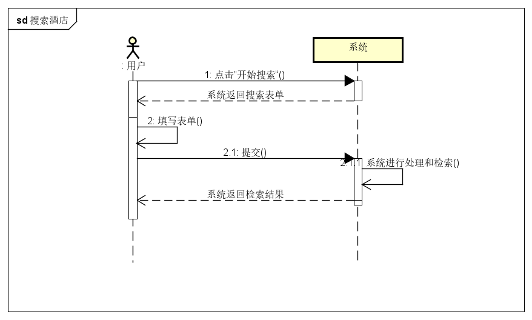

#### 4.11 取消订单

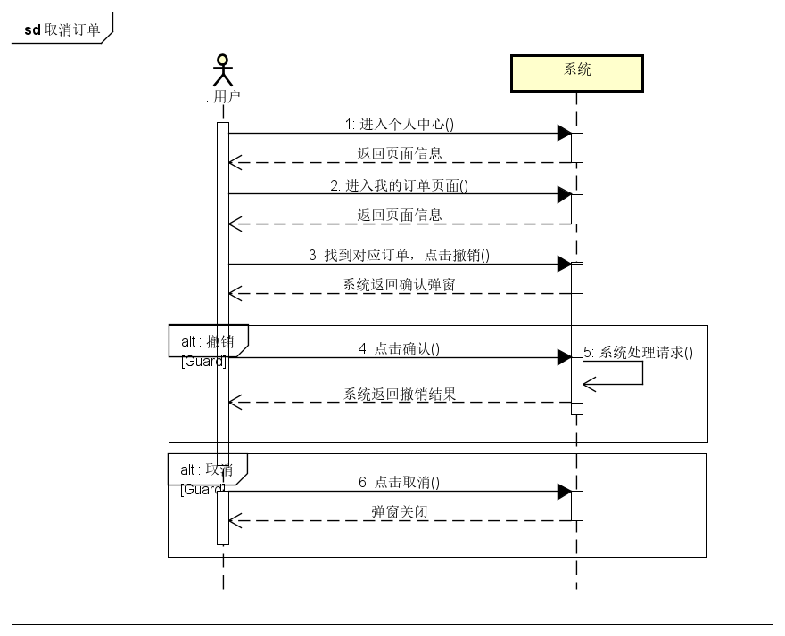

#### 4.12 打分及添加评论

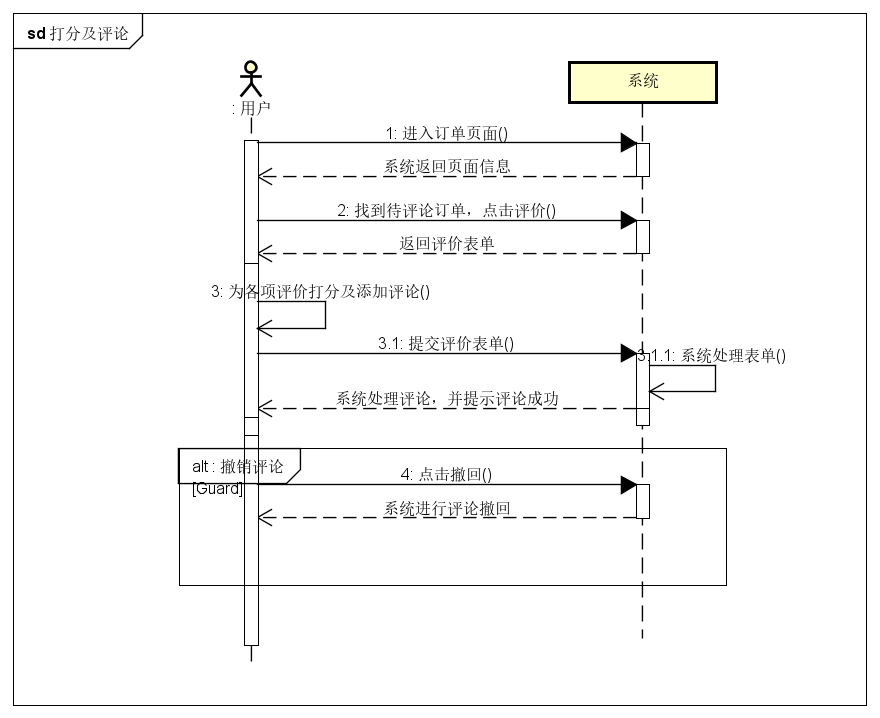

#### 4.13 向酒店提问

#### 4.14 收藏酒店

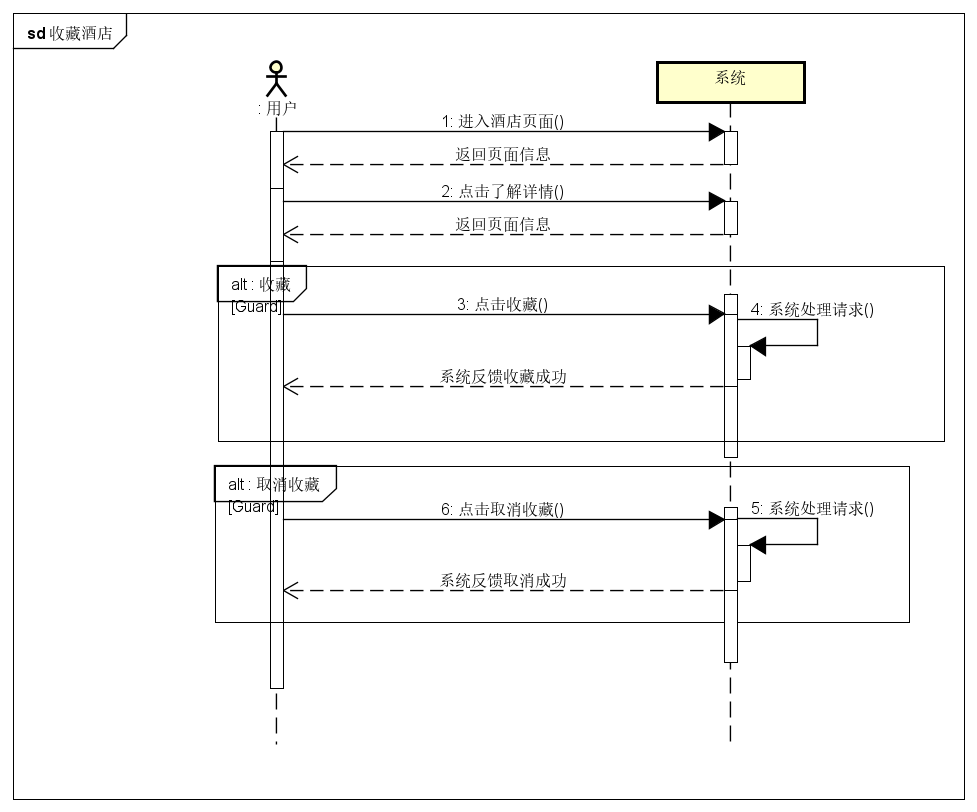

#### 4.15 注册会员

#### 4.16 申诉异常订单

#### 4.17 管理酒店房间

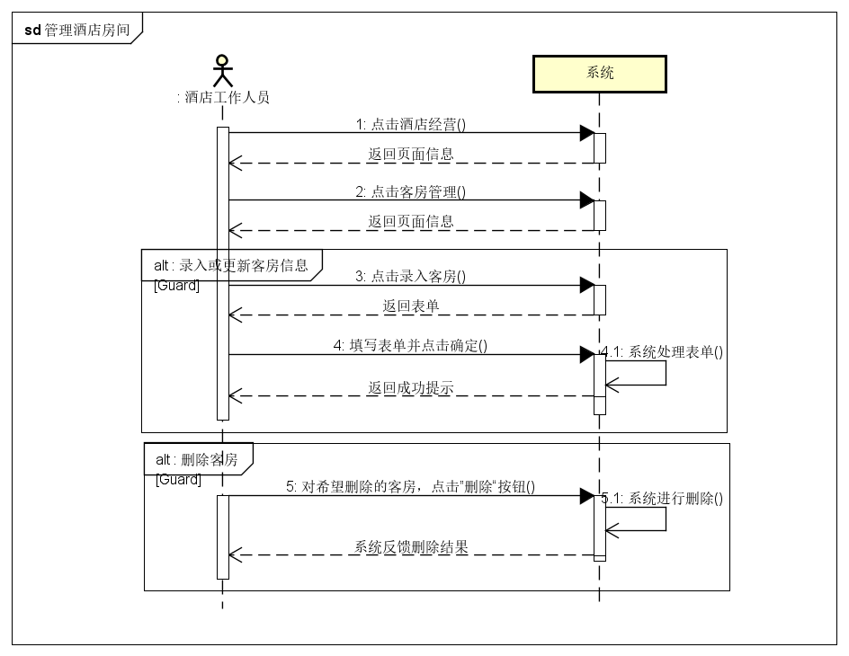

#### 4.18 办理入住

#### 4.19 设置订单异常

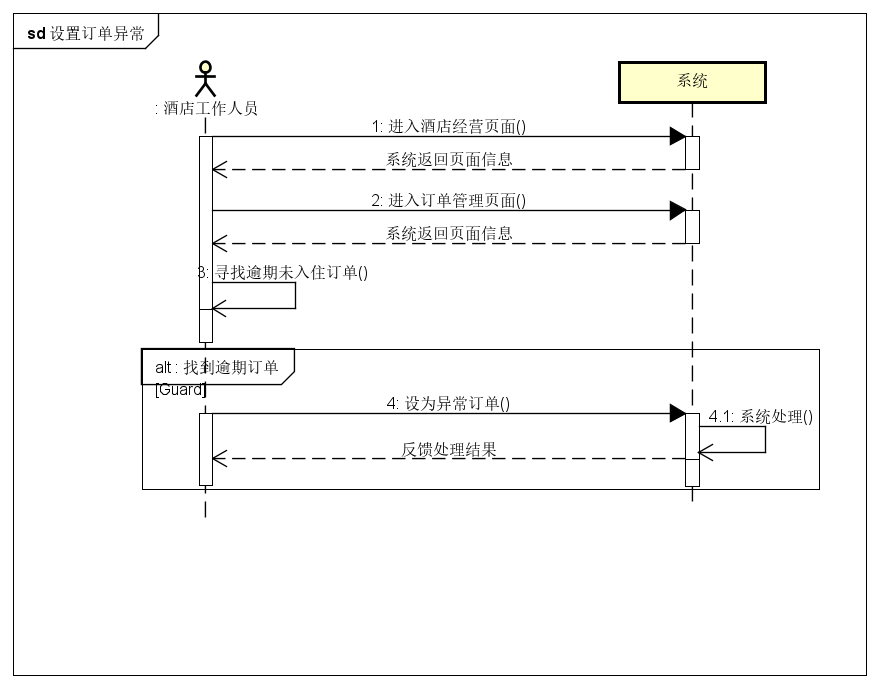

#### 4.20 设置优惠策略

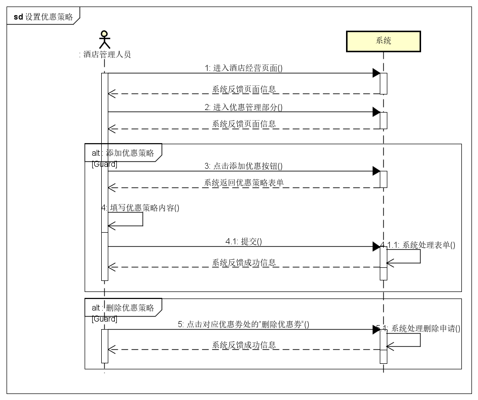

#### 4.21 查看订单及营收情况

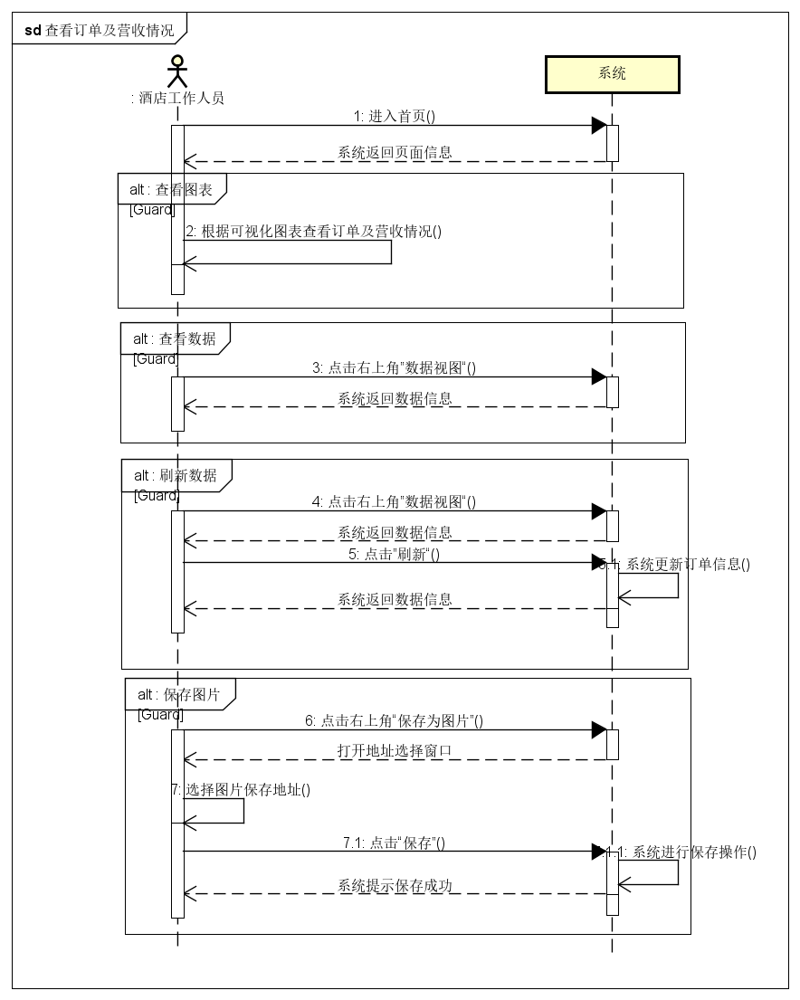

### 5.2 概念类图

### 5.3 状态图

